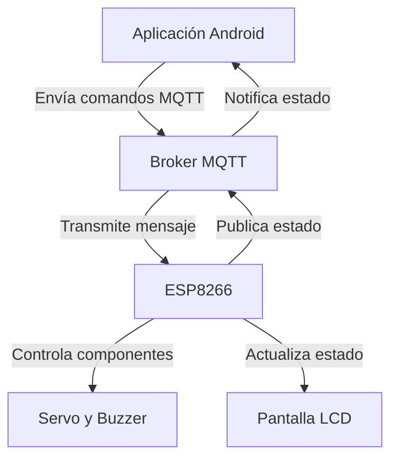

# Proyecto Caja Fuerte Controlada por App Android

Este proyecto desarrolla una caja fuerte inteligente controlada remotamente mediante una aplicación Android escrita en Java. Utiliza un microcontrolador ESP8266 para conectarse a una red WiFi y emplea el protocolo MQTT para recibir comandos y controlar un mecanismo de bloqueo mediante un servomotor. Además, ofrece retroalimentación sonora y visual con un buzzer y una pantalla LCD.

---

## **Características Principales**

- **Conectividad WiFi**: Permite al ESP8266 conectarse a redes WiFi para comunicación remota.
- **Protocolo MQTT**: Facilita el intercambio de comandos y estado entre el microcontrolador y el broker.
- **Control de Servomotor**: Gestión precisa del mecanismo de bloqueo.
- **Retroalimentación con buzzer**: Señales audibles para confirmar acciones.
- **Pantalla LCD I2C**: Indica el estado actual de la caja (abierta/cerrada).
- **Integración con Node-RED**: Dashboard básico para monitorear y controlar la caja fuerte.

---

## **Prerrequisitos**

Antes de comenzar, asegúrate de contar con:
- IDE de Arduino instalado.
- Librerías necesarias: ESP8266WiFi, PubSubClient, Servo, ArduinoJson, Wire, LiquidCrystal_I2C.
- Broker MQTT funcional (público o privado).
- Aplicación Android instalada y configurada para interactuar con el servidor MQTT.

---

## **Componentes del Proyecto**

### **Hardware**
- **ESP8266**: Proporciona conectividad WiFi y capacidad de procesamiento.
- **Servomotor**: Controla la apertura y cierre de la caja.
- **Pantalla LCD I2C**: Muestra el estado en tiempo real.
- **Buzzer**: Da retroalimentación sonora.
- **Fuente de alimentación**: Suministra energía al ESP8266 y componentes adicionales.

### **Software**
- **Arduino IDE**: Plataforma utilizada para programar el ESP8266.
- **Aplicación Android**: Interfaz de usuario para enviar comandos.
- **Node-RED Dashboard**: Control y monitoreo visual.

---

## **Configuración del Proyecto**

1. **Configura el código**:
    - Abre el archivo del proyecto en el IDE de Arduino.
    - Configura las credenciales de tu red WiFi (`SSID` y `contraseña`).
    - Define la dirección del broker MQTT en el código.
2. **Carga el código en el ESP8266**:
    - Conecta el ESP8266 a tu PC mediante un cable USB.
    - Verifica y carga el programa desde el IDE.
3. **Prepara el hardware**:
    - Conecta el servomotor, pantalla LCD y buzzer a los pines definidos.
    - Conecta el ESP8266 a una fuente de alimentación confiable.
4. **Configura el broker MQTT**:
    - Utiliza un broker público como `broker.emqx.io` o configura uno propio.

---

## **Protocolo de Comunicación**

El sistema utiliza el formato JSON para enviar y recibir datos. Ejemplos:
- **Comando de apertura:** `{ "msg": "ABIERTO" }`
- **Comando de cierre:** `{ "msg": "CERRADO" }`
- **Estado de la caja:** `{ "estado": "CERRADO" }`

---

## **Diagrama de Flujo**

