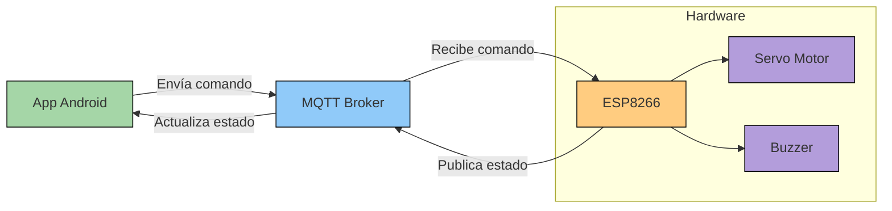

# Proyecto Caja Fuerte Controlada por App Android

Este proyecto consiste en una caja fuerte controlada mediante una aplicación Android en Java. La caja fuerte se abre y cierra de forma remota usando un sistema ESP8266 que se conecta a través de MQTT. Al recibir las órdenes de apertura o cierre desde la app, el sistema mueve un servo que controla el pestillo de la caja fuerte y emite sonidos con un buzzer para confirmar la operación.

## Descripción del Proyecto

La caja fuerte cuenta con los siguientes componentes y funciones:

-   **Conexión WiFi**: El ESP8266 se conecta a una red WiFi configurada en el código.
-   **Comunicación MQTT**: Las órdenes de apertura y cierre se envían y reciben a través de un servidor MQTT.
-   **Servo Motor**: Controla el ángulo de apertura y cierre de la caja fuerte.
-   **Buzzer**: Emite sonidos cortos al abrir y un sonido más largo al cerrar.

### Estructura de Archivos

-   `ESP8266WiFi.h`, `PubSubClient.h`, `Servo.h`, `ArduinoJson.h`: Librerías necesarias para manejar WiFi, MQTT, el servo y el manejo de mensajes JSON.
-   Código para manejar la lógica de apertura y cierre basado en el estado de la caja fuerte.

## Hardware Necesario

-   **ESP8266**: Microcontrolador para la conexión WiFi y comunicación MQTT.
-   **Servo Motor**: Control del mecanismo de apertura y cierre de la caja fuerte.
-   **Buzzer**: Emisión de sonidos de confirmación.
-   **Fuente de energía adecuada** para el ESP8266 y el servo motor.

## Diagrama Circuito

## Configuración del Proyecto
1.  **Conectar el ESP8266** a tu red WiFi proporcionando los datos de SSID y contraseña en el código.
2.  **Configurar el servidor MQTT**:
    -   Usar un broker público como `broker.emqx.io` o configurar uno privado.
    -   Configurar los tópicos MQTT para la comunicación de estado y control:
        -   `ESP/Abierto`: Tópico de apertura.
        -   `ESP/Cerrado`: Tópico de cierre.
        -   `ESP/Estado`: Tópico para enviar el estado actual de la caja fuerte.
3.  **Conectar el servo y el buzzer** a los pines definidos en el código:
    -   `SERVO_PIN`: Pin digital conectado al servo.
    -   `BUZZER_PIN`: Pin digital conectado al buzzer.

## Instrucciones de Uso

1.  **Cargar el código** en el ESP8266 y encender el dispositivo.
2.  La **aplicación Android** debe conectarse al servidor MQTT y enviar comandos en formato JSON.
    -   Comando para abrir: `{ "msg": "ABIERTO" }`
    -   Comando para cerrar: `{ "msg": "CERRADO" }`
3.  Al recibir los mensajes, el ESP8266 activará el servo y el buzzer en función del comando recibido.

## Diagrama de Flujo

## Bibliotecas Utilizadas

-   **ESP8266WiFi**: Para manejar la conexión WiFi.
-   **PubSubClient**: Para la comunicación MQTT.
-   **Servo**: Para controlar el movimiento del servo motor.
-   **ArduinoJson**: Para deserializar y serializar mensajes en formato JSON.
