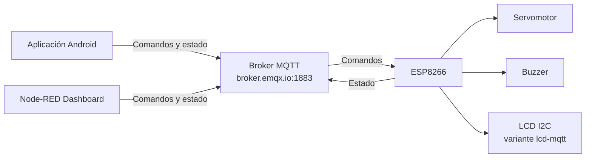

# Sistema IoT de Caja de Seguridad

> Sistema IoT de control y supervisión de una caja fuerte mediante una aplicación Android, MQTT, ESP8266 y Node-RED.

<p align="center">
  
  
  
  
  
</p>

CajaDeSeguridad integra una aplicación Android, firmware para ESP8266, comunicación MQTT y un flujo Node-RED para controlar y supervisar una caja fuerte. El sistema permite enviar comandos de apertura y cierre, accionar el mecanismo mediante un servomotor y recibir el estado publicado por el microcontrolador.

Fue desarrollado en conjunto para una asignatura de Android e IoT. La variante de firmware con LCD añade visualización local del estado, mientras que Node-RED ofrece una interfaz alternativa de control y monitoreo.

## Características

- Autenticación local mediante PIN.
- Apertura y cierre mediante comandos MQTT.
- Control desde una aplicación Android.
- Recepción y visualización del estado de la caja.
- Dashboard Node-RED como interfaz alternativa.
- Accionamiento mediante servomotor.
- Señalización mediante buzzer.
- Visualización mediante LCD I2C en la variante correspondiente.

## Arquitectura


```mermaid
flowchart LR
    Android[Aplicación Android]
    NodeRED[Node-RED Dashboard]
    Broker[Broker MQTT<br/>broker.emqx.io:1883]
    ESP[ESP8266]
    Servo[Servomotor]
    Buzzer[Buzzer]
    LCD[LCD I2C<br/>variante lcd-mqtt]

    Android -->|Comandos y estado| Broker
    NodeRED -->|Comandos y estado| Broker
    Broker -->|Comandos| ESP
    ESP -->|Estado| Broker
    ESP --> Servo
    ESP --> Buzzer
    ESP --> LCD
```

MQTT actúa como capa de comunicación entre Android, Node-RED y el ESP8266. El microcontrolador procesa los comandos recibidos y publica los cambios de estado.

[Ver arquitectura detallada →](docs/architecture.md)

## Tecnologías

| Componente | Tecnología | Aplicación |
| --- | --- | --- |
| Aplicación móvil | Android + Java | PIN local, comandos y estado |
| Build Android | Gradle + Kotlin DSL | Configuración del proyecto |
| Microcontrolador | ESP8266 + Arduino | Control del hardware |
| MQTT en Android | Eclipse Paho | Publicación y suscripción |
| MQTT en firmware | PubSubClient | Comandos y estados |
| Automatización | Node-RED Dashboard | Control y monitoreo alternativos |
| Display | LCD I2C | Visualización local del estado |

## Estructura del repositorio

```text
CajaDeSeguridad/
├── android/              # Aplicación Android
├── firmware/
│   ├── basic-mqtt/       # Firmware base
│   └── lcd-mqtt/         # Firmware con LCD I2C
├── node-red/             # Flujos Node-RED
├── img/                  # Diagramas e imágenes
├── docs/                 # Documentación técnica
├── README.md
└── .gitignore
```

## Aplicación Android

La aplicación comienza con un acceso mediante PIN local y ofrece una pantalla principal con acciones para abrir y cerrar la caja. Publica el comando MQTT correspondiente y recibe el estado desde `ESP/Estado`.

El proyecto Android se encuentra bajo `android/`. La compilación requiere un entorno con Android SDK configurado.

## Comunicación MQTT

Los componentes se comunican mediante MQTT utilizando `broker.emqx.io:1883`.

Los tópicos principales son `ESP/Abierto`, `ESP/Cerrado` y `ESP/Estado`.

[Ver comunicación MQTT →](docs/mqtt.md)

## Configuración

[Guía de configuración →](docs/setup.md)

Las credenciales locales se mantienen fuera del repositorio. Para el firmware se proporciona una plantilla mediante [firmware/config-example.h](firmware/config-example.h).

## Documentación

- [Arquitectura](docs/architecture.md) — componentes y flujo general del sistema.
- [Comunicación MQTT](docs/mqtt.md) — tópicos y flujo de mensajes.
- [Configuración](docs/setup.md) — requisitos y puesta en marcha.
- [Diagrama de circuito](img/circuito.png)
- [Circuito LCD I2C](img/circuito_lcd_i2c.png)

## Contexto

Proyecto académico desarrollado en conjunto para una asignatura de Android e IoT.

El repositorio se conserva como referencia técnica y portafolio del trabajo realizado.
