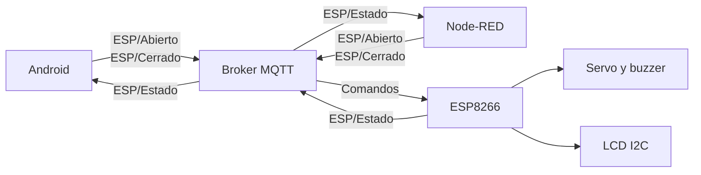

# Arquitectura

## Visión general

El sistema combina una aplicación Android y un dashboard Node-RED como clientes MQTT. Ambos envían comandos al broker; el firmware cargado en un ESP8266 recibe esos comandos, acciona la caja y publica su estado.

## Componentes

- **Android**: solicita un PIN local y ofrece botones para publicar comandos. Se suscribe a `ESP/Estado` y muestra el valor `estado` del JSON recibido.
- **Firmware `basic-mqtt`**: conecta el ESP8266 a WiFi, se suscribe a los tópicos de apertura y cierre, controla el servo y el buzzer, y publica el estado.
- **Firmware `lcd-mqtt`**: mantiene el comportamiento MQTT y de actuadores, y añade una pantalla LCD I2C para mostrar el estado.
- **Broker MQTT**: intermediario de los mensajes. El código contiene `broker.emqx.io` y el puerto `1883`.
- **Node-RED**: contiene botones para publicar comandos, un texto para mostrar el estado y un gauge que transforma `ABIERTO`/`CERRADO` en valores visuales.

## Flujo de datos

1. Android o Node-RED publica un JSON de comando en `ESP/Abierto` o `ESP/Cerrado`.
2. El firmware recibe el comando, valida `msg` y acciona el servo cuando corresponde.
3. El firmware publica `{"estado":"ABIERTO"}` o `{"estado":"CERRADO"}` en `ESP/Estado`.
4. Android y Node-RED reciben ese estado y actualizan sus interfaces.

Los mensajes y tópicos están detallados en [mqtt.md](mqtt.md).
